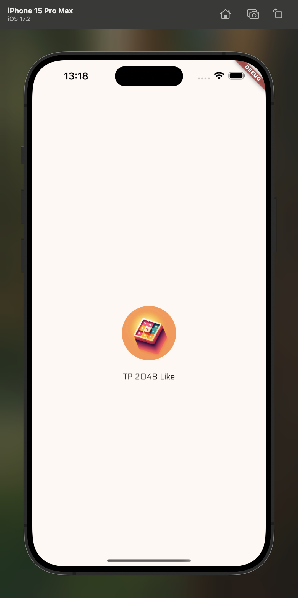
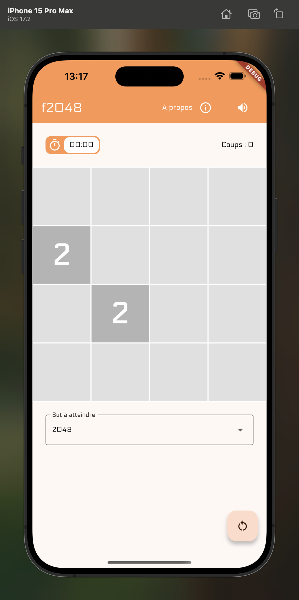
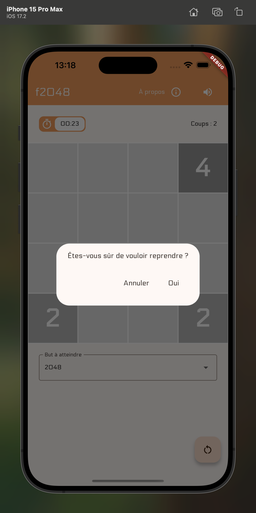
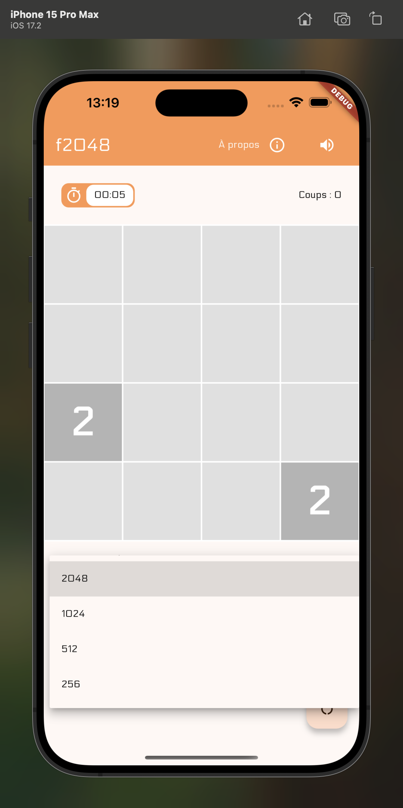
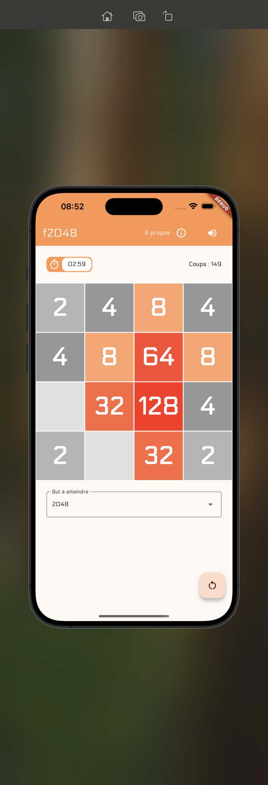
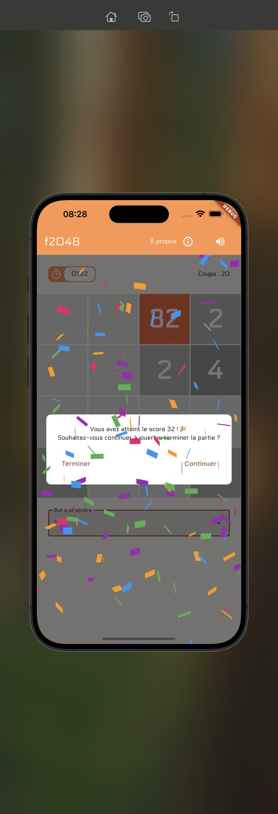
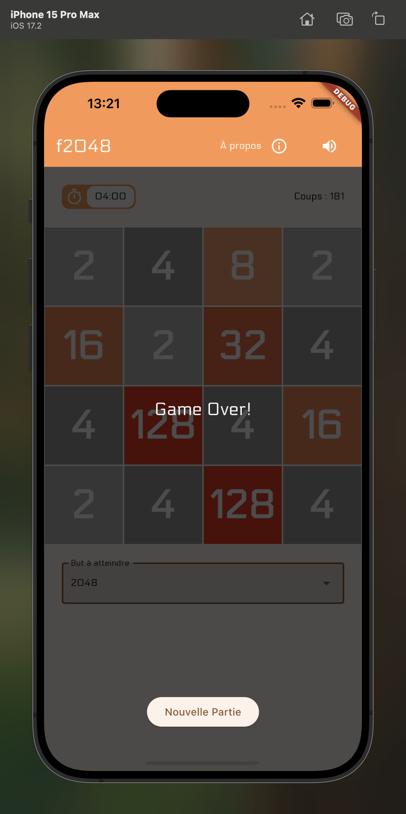
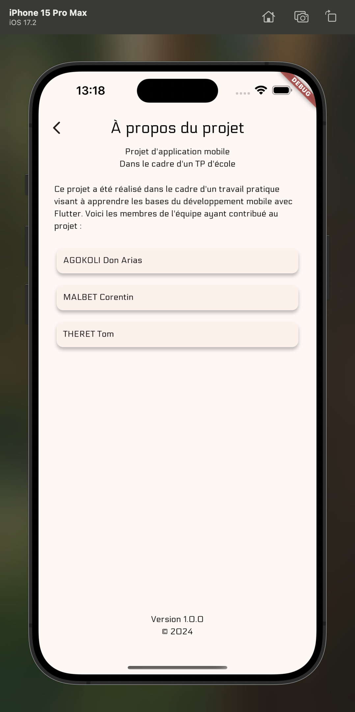

# TP2048 - Un clone du jeu 2048 en Flutter

## 📱 Présentation

TP2048 est une réimplémentation moderne du célèbre jeu 2048 développée avec Flutter. Le jeu propose
une expérience fluide et personnalisable avec plusieurs fonctionnalités innovantes.

## Screenshots

|                      Screen 1                      |                      Screen 2                      |
|:--------------------------------------------------:|:--------------------------------------------------:|
|  |  |

|                      Screen 3                      |                      Screen 4                      |
|:--------------------------------------------------:|:--------------------------------------------------:|
|  |  |

|                      Screen 5                      |                      Screen 6                      |
|:--------------------------------------------------:|:--------------------------------------------------:|
|  |  |

|                      Screen 7                      |                      Screen 8                      |
|:--------------------------------------------------:|:--------------------------------------------------:|
|  |  |

## ✨ Fonctionnalités principales

### 🎮 Gameplay

- Glissez pour déplacer les tuiles dans les 4 directions
- Fusionnez les tuiles de même valeur pour obtenir des nombres plus élevés
- Objectif personnalisable : choisissez votre but (256, 512, 1024 ou 2048)
- Système de score et compteur de mouvements

### 🎯 Modes de jeu

- Mode classique avec objectif configurable
- Possibilité de continuer après avoir atteint l'objectif
- Détection automatique de fin de partie

### 🎨 Interface utilisateur

- Design moderne et épuré
- Animations fluides
- Thème visuel cohérent
- Écran d'introduction animé
- Page "À propos" avec informations sur le projet

### 🔊 Sons et effets

- Effets sonores pour les mouvements et fusions
- Option pour activer/désactiver le son
- Animation de confettis lors de la victoire

## 🛠️ Technologies utilisées

- Flutter 3.24.5
- Dart 3.5.4
- Provider pour la gestion d'état
- Diverses bibliothèques Flutter pour les animations et effets

## 🔌 Plugins

| Name                                                                   | Usage               |
|------------------------------------------------------------------------|---------------------|
| [**Flutter Svg**](https://pub.dev/packages/flutter_svg)                | Draw SVG files icon |
| [**Provider**](https://pub.dev/packages/provider)                      | State Management    |
| [**Confetti**](https://pub.dev/packages/confetti)                      | Animation celebrate |
| [**Audio Players**](https://pub.dev/packages/audioplayers)             | Play audio files    |
| [**Text Animator**](https://pub.dev/packages/widget_and_text_animator) | Text animations     |

## 📦 Installation

1. Clonez le repository

`git clone github.com/dongorias/Tp2048Like.git`

3. Installez les dépendances

`flutter pub get`

4. Lancez l'application

`flutter run`

## 🎯 Objectifs du projet

Ce projet a été réalisé dans le cadre d'un travail pratique universitaire visant à :

- Apprendre les bases du développement mobile avec Flutter
- Mettre en pratique les concepts de programmation orientée objet
- Implémenter une logique de jeu complexe
- Créer une interface utilisateur moderne et responsive

## 👥 Équipe

- AGOKOLI Don Arias
- MALBET Corentin
- THERET Tom

## 📄 Licence

Ce projet est distribué sous licence MIT. Voir le fichier `LICENSE` pour plus d'informations.

## 🔧 Configuration requise

- Flutter SDK ≥ 3.24.5
- Dart SDK ≥ 3.5.4
- Android SDK ou iOS SDK pour le déploiement mobile

## 🚀 Déploiement

L'application peut être déployée sur :

- Android (API 21+)
- iOS (12.0+)

Un workflow GitHub Actions est configuré pour générer automatiquement les APK de release.
